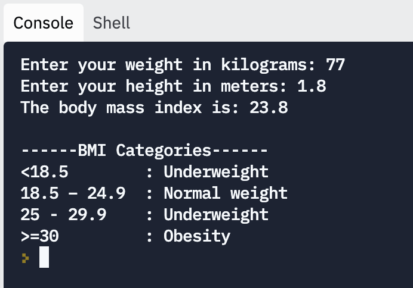

# Body Mass Index

> Body mass index is a value derived from the mass and height of a person. The BMI is defined as the body mass divided by the square of the body height and is expressed in units of kg/m², resulting from mass in kilograms and height in meters. 
~[Wikipedia](https://en.wikipedia.org/wiki/Body_mass_index)

Calculating the body mass index is useful for many medical cases. Plus, it makes a nice challenge for the skills you've learned so far, dealing with input, variables, and data types.

Your task in this assignment is to create a body mass index calculator in Python. The program should ask the user for a person's weight and height, calculate the body mass index using the BMI formula, and output that value along with other meaningful information about body mass index.

## Sample Run

Here's what a successful run of the program should look like:

## Steps

1. **Run the code**

If we have a starter code, it is always a good practice to run it first to get a sense of what the code does, whether it interprets successfully or not, and what type of runtime errors we get when we test it.

2. **Write code to solve the problem**

Read the requirements carefully and write your solution in the `main.py` file. Follow the comments, and complete all the TODO items there.

3. **Test your solution**

Run the test cases and make sure your code passes all the test cases before submitting. If any case fails, read the case results carefully, and fix the problems before submitting.

## Testing

1. Test your code by running the code with `python3 main.py` and trying different values.
2. Check your code against the automated tests with `python3 test_main.py`.

One way to test your code is to compare the output of your program to the output from another program you know is right. You can find a tool that solves the same problem, feed the same input to the tool and your program, and compare your output with theirs.

This tool is an [online BMI calculator](https://www.nhlbi.nih.gov/health/educational/lose_wt/BMI/bmi-m.htm) you can use to compare your output.

(Make sure you select the metric measurement system.)
