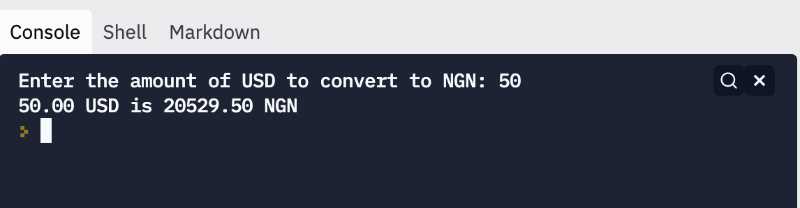

# Currency Conversion

In this exercise, you'll help the user convert currency from US Dollars to Naira.

Write a program that prompts the user for a USD value, and outputs the value, converted to NGN.

1. Use `input` to get the USD value from the user
2. Convert to NGN by multiplying by the exchange rate
3. Print out the value

The starter code specifies the exchange rate to use:

```python
NAIRA_PER_DOLLAR = 424.55 # Central Bank exchange rate
```

## Sample Run

Here's a sample run of the program you are aiming to reproduce:



## Testing

To test your code:

1. Try it out interactively. Run `python3 main.py` in the terminal, or use your
   editor integration.
2. Run the automated tests. Run `python3 test_main.py` in the terminal.

## Hints

1. The tests are picky about exactly what you print out! Pay special attention to your `print` statements, so that your code is exactly right.

2. To format the decimals in the numbers correctly, you can use an *f-string*, like this: `print(f"{value:.2f} NGN")`.
